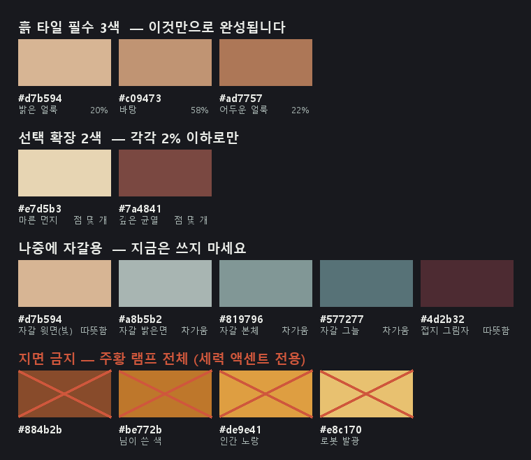
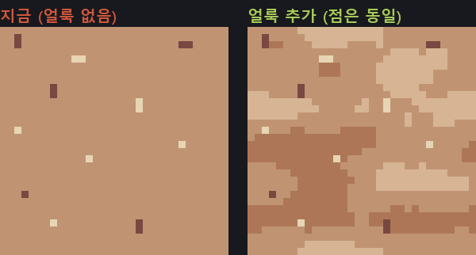
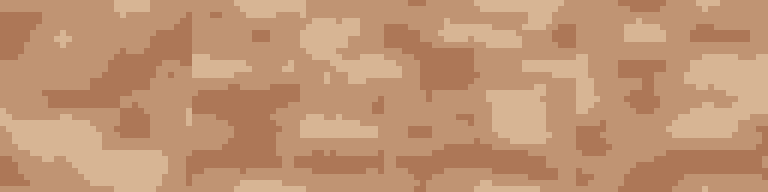
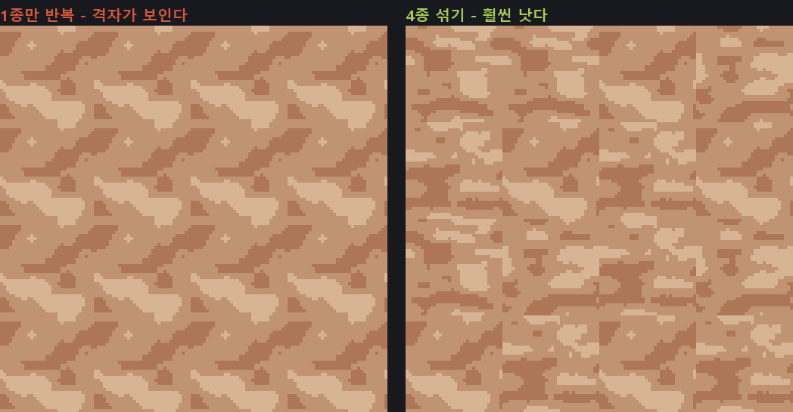
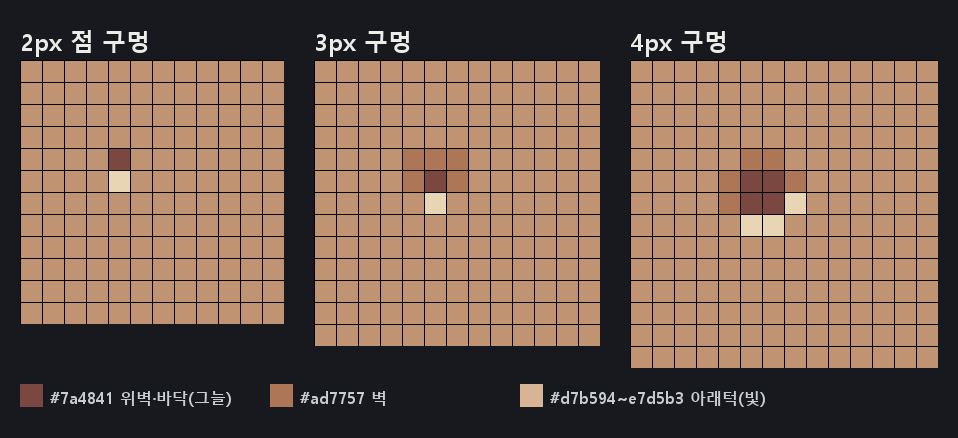
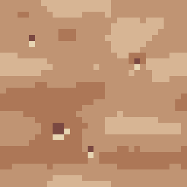
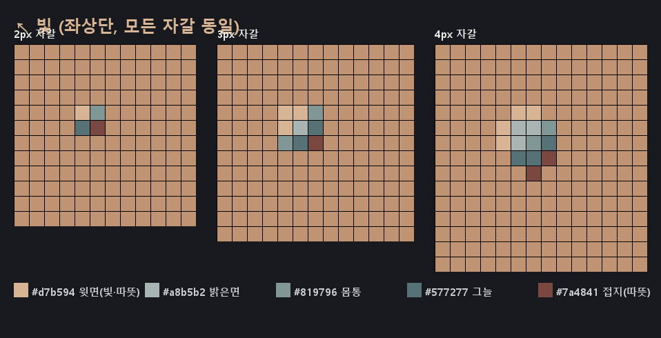
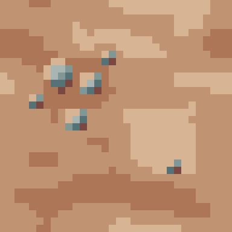
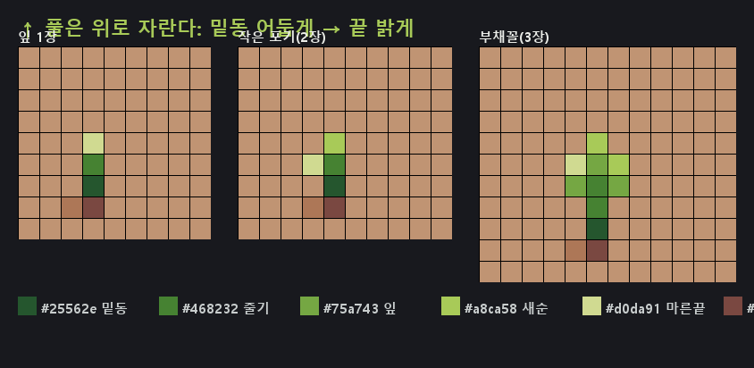
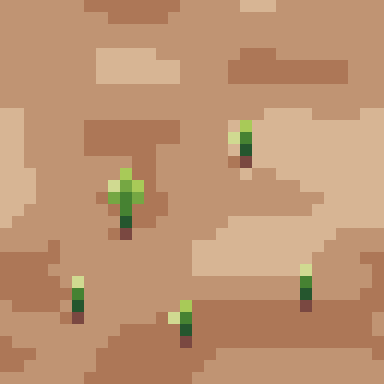

# 타일 그리는 법 — 마른 흙 타일 (32×32)

> 팔레트: **Apollo 46색** (`../art/apollo.gpl` — Pixelorama 창에 드래그하면 됨)
> 이 문서는 "마른 흙 바닥 타일" 한 장 기준. 자갈·풀은 이게 끝난 뒤.

---

## 0. 대원칙 세 줄

1. **얼룩(구조)을 먼저, 점(장식)은 마지막.** 반대로 하면 그냥 노이즈다.
2. **베이스 타일은 지루할수록 좋다.** 위에 캐릭터·작물·건물이 올라간다.
3. **한 장을 완벽하게 만들지 말고, 적당한 걸 4장 만들어라.** 변화는 타일 *안*이 아니라 타일 *사이*에서 나온다.

---

## 1. 색 — 3 + 2 규칙

**같은 램프(brown)에서 서로 붙어있는 3단계** + 액센트 2색. 그게 전부다.

| hex | Apollo 위치 | 역할 | 목표 px | 비율 |
| --- | --- | --- | --- | --- |
| `#c09473` | brown 4 | **바탕** | ~575 | 56% |
| `#ad7757` | brown 3 | 어두운 얼룩 | ~225 | 22% |
| `#d7b594` | brown 5 | 밝은 얼룩 | ~205 | 20% |
| `#7a4841` | brown 2 | 깊은 균열 **(점)** | ~9 | 0.9% |
| `#e7d5b3` | brown 6 | 마른 먼지 **(점)** | ~8 | 0.8% |

32×32 = **1024px** 기준. 합계 1022px.



### 절대 쓰지 말 것 — 주황 램프 전체

`#341c27` `#602c2c` `#884b2b` `#be772b` `#de9e41` `#e8c170`

주황 램프는 갈색보다 **채도가 훨씬 높다.** 지면에 쓰면 흙이 아니라 형광 진흙이 된다.
게다가 `#de9e41`은 인간 세력 노랑, `#e8c170`은 로봇 발광색으로 예약돼 있다.
**주황 램프는 통째로 "인공물·불빛·세력 액센트" 전용으로 비워둔다.**

### 왜 인접 3단계인가

| | 명도 | 채도 |
| --- | --- | --- |
| `#e8c170` (orange 6) | 195 | 52% |
| `#be772b` (orange 4) | 132 | **77%** |
| `#d7b594` (brown 5) | 187 | 31% |
| `#c09473` (brown 4) | 157 | 40% |
| `#ad7757` (brown 3) | 131 | 50% |

주황 조합은 어두워지면서 채도가 **25%p 뛴다.** 어두운 쪽이 더 쨍해지니 얼룩이 앞으로 튀어나온다.
갈색 램프는 31 → 40 → 50으로 완만하다. 명도 총 폭은 비슷한데(63 vs 56),
**주황은 2색으로 절벽을 뛰고 갈색은 3색으로 계단을 밟는다.** 중간 단계 하나가 전부를 바꾼다.

---

## 2. 순서 — 이거 틀리면 다 틀린다

```
① 바탕 채우기  →  ② 어두운 얼룩  →  ③ 밝은 얼룩  →  ④ 경계 갉기  →  ⑤ 점 찍기
```

점을 먼저 찍으면 평평한 바닥에 먼지가 흩날리는 그림이 된다.
같은 점이라도 밑에 얼룩이 깔리면 "흙의 디테일"로 읽힌다:



*왼쪽과 오른쪽의 점은 픽셀 단위로 완전히 동일하다. 밑에 구조가 있냐 없냐 차이뿐이다.*

---

## 3. 얼룩 그리기

### 크기와 개수

- **얼룩 하나 = 70~75px.** 대략 **12×8** 크기의 불규칙한 덩어리
- **색당 3개**: 큰 거 1 / 중간 1 / 작은 1 — 전부 같은 크기면 인공적으로 보인다
- 가로:세로 **약 2:1로 길쭉하게.** 방향은 얼룩마다 다르게
- **일부는 타일 경계를 넘겨서** 그린다. 잘린 얼룩이 옆 타일과 이어져야 이음새가 안 보인다
- 밝은 얼룩은 어두운 얼룩과 **겹치지 않게 어긋나게** 배치

### 형태

```
좋음 (길쭉 + 너덜 + 구멍)          나쁨 (뭉친 덩어리)

..██....█......                        ..████..
.██████...█....                        .██████.
███████████....                        .██████.
.██..████████..                        ..████..
......██...█...
```

**필수 기법 두 개:**

- **낱픽셀 흩뿌리기** — 얼룩 경계 *바깥*에 1px을 3~4개 떼어놓는다. 경계가 녹아서 유기적으로 보인다. 효과가 제일 크다.
- **구멍 뚫기** — 얼룩 *안쪽*에 바탕색 1~2px을 몇 군데 찍어 속을 비운다. 꽉 찬 덩어리는 인공적이다.

마지막에 **1px 연필로 모든 얼룩 테두리를 훑으며** 픽셀을 하나씩 더하고 뺀다. 매끈한 곡선이 하나도 남으면 안 된다.

### 금지 목록

- ❌ **이름 붙일 수 있는 모양** — "바나나", "뱀", "얼굴"이 보이면 다시 그린다. 타일을 깔면 똑같은 바나나가 격자로 수십 개 나타난다
- ❌ 직선, 특히 완벽한 45° 대각선 (해칭·긁힌 자국처럼 보인다)
- ❌ 좌우대칭
- ❌ 균일한 간격 — 뭉친 데는 뭉치고, 넓게 빈 데도 남긴다
- ❌ **명암 넣기** — 얼룩은 입체가 아니다. 흙의 습도·성분 차이일 뿐 평평하다.
  (광원은 자갈·바위 같은 *오브젝트*의 몫이다. 이걸 헷갈리면 바닥이 울퉁불퉁해 보여서 그 위 자갈이 안 보인다)

---

## 4. 점 찍기 — 마지막 2%

| 색 | 크기 | 개수 | 총 px |
| --- | --- | --- | --- |
| `#7a4841` | 1~2px | 4~5개 | ~9 |
| `#e7d5b3` | 1px | 3~4개 | ~8 |

- **덩어리로 칠하면 안 된다.** 이 둘은 램프 양 끝이라 면적이 커지는 순간 튄다
- 서로 멀리 떨어뜨린다
- **얼룩 경계 근처에 붙인다.** 허공에 균일하게 뿌리면 노이즈가 된다

---

## 5. 검증 — 세 가지 다 하기

### ① Tile Mode

Pixelorama **View 메뉴 > Tile Mode**. 캔버스가 3×3으로 반복돼 보인다.
**켜놓고 그린다.** 안 켜고 그리면 100% 다시 그리게 된다.

확인할 것: 가장자리 이음새 / 같은 모양의 격자 반복 / 대각선 흐름

### ② 실눈 테스트

100% 배율로 축소하고 눈을 가늘게 뜬다.
**거의 균일한 한 덩어리 갈색으로 보여야 정상.**
어느 한 지점에 시선이 꽂히면 그 부분의 대비가 센 것이다.

### ③ 캐릭터 올려보기

스프라이트를 임시로 올린다. 바닥이 시끄러운지는 그때 바로 안다.
캐릭터가 안 읽히면 밝은 얼룩(`#d7b594`)을 빼고 **2색(`#c09473` + `#ad7757`)만** 써도 된다.

---

## 6. 변형 타일 4장

한 장이 끝나면 복제해서 **얼룩 위치만 옮긴 변형 3장**을 더 만든다.





왼쪽처럼 **한 장만 반복하면 아무리 잘 그려도 격자가 보인다.** 4종을 섞으면 훨씬 낫다.
완벽하진 않지만 실제 게임에서는 이 위에 풀·자갈·작물·건물이 올라가서 나머지를 가린다.

---

## 7. 실제로 했던 실수들

| 시도 | 측정값 | 문제 |
| --- | --- | --- |
| 1차 | `#e8c170` 95.8% / `#be772b` 4.2% | **주황 램프** 사용 + 2단계 점프 + 평평한 바탕에 점만 |
| 2차 | brown 2·3·4·5·6 (5단계) | 액센트 2색을 **얼룩처럼 크게** 칠함. 가운데 "바나나" 실루엣이 생김 |
| 3차 | `#c09473` 98.3% + 점 17px | 얼룩을 **통째로 삭제.** 점 비율은 정확했지만 구조가 없음 |

세 번 다 원인이 다르다. 순서대로 정리하면
**램프 고르기 → 단계 좁히기 → 얼룩 먼저 → 점은 나중.**

### 참고 결과물

- `img/mottle_over_yours.png` — 32×32 실물 (Pixelorama에서 열어 스포이드로 찍어볼 것)
- `img/mottle_over_yours_x10.png` — 10배 확대
- `img/variants_4.png` — 128×32, 얼룩 타일 4종 스트립

이건 프로그램으로 생성한 거라 **"정답"이 아니라 "기준점"이다.**
손으로 그리면 의도가 들어가서 더 좋아진다 — "여긴 물이 고였던 자리" 같은 건 알고리즘이 못 한다.

---

## 8. 변형 타일 4종 — 규칙이 타일마다 뒤집힌다

베이스 흙 위에 뭔가를 얹어 변형을 만든다. 핵심은 **얹는 것마다 명암 규칙이 다르다**는 것.
이 차이가 4종을 서로 다르게 보이게 한다.

| 타일 | 얹는 것 | 명암 규칙 | 배치 |
| --- | --- | --- | --- |
| ① 기본 흙 | 얼룩만 | 평평 (광원 없음) | — |
| ② 구멍 흙 | 오목 구멍 | **위 어둡고 아래 밝음** | 흩뿌림 2~3개 |
| ③ 자갈 흙 | 볼록 자갈 | **위 밝고 아래 어둡고 + 접지** | **뭉침** |
| ④ 풀 흙 | 세로 풀포기 | **밑동 어둡고 끝 밝음** | 흩뿌림 5개 |

### ★ 제일 중요한 규칙: 바탕은 복제해서 통일한다

변형 타일을 매번 바탕부터 새로 그리면 **바탕 얼룩 밀도가 제각각**이 된다.
실제로 이 프로젝트에서 tile 1·2·3을 새로 그렸더니 바탕이 88% / 73% / 88%로 튀었다
(기본 타일은 66%). 이걸 맵에 섞어 깔면 **바닥이 깜빡거린다.**

> **tile(0,0) 완성본을 복제 → 붙여넣기 → 그 위에 구멍/자갈/풀만 얹는다.**
> 바탕을 다시 그리지 마라. 네 타일 바탕이 100% 일치해야 한다. 차이는 얹힌 것뿐이어야 한다.

---

## 9. ② 구멍 (오목)

빛은 위에서 온다. 구멍은 파여서 **위쪽 벽이 그늘지고 아래쪽 턱이 빛을 받는다.**
이 뒤집힘이 구멍을 구멍으로 만든다.



```
2px 점 구멍   ▓        위: #7a4841 (그늘)
              ░        아래 1px: #e7d5b3 (빛)

3px 구멍     ▒▒▒       위 가장자리: #ad7757
             ▒▓▒       가운데 바닥: #7a4841 (제일 어두움)
              ░        아래턱: #e7d5b3

4px 구멍     .▒▒.
             ▒▓▓▒
             ▒▓▓░      아래·오른쪽 턱: #d7b594
              ░░.
```

- **핵심은 아래턱의 밝은 1~2px.** 이게 없으면 그냥 어두운 점이다.
- 개수 적게 — 타일당 **2~3개**. 큰 구멍은 1개면 충분.
- 스듀도 구멍 타일은 전체의 10~20%만 드물게 섞인다.



---

## 10. ③ 자갈 (볼록) — 구멍의 정반대

| | 위 | 아래 | 접지 |
| --- | --- | --- | --- |
| 구멍(오목) | 어두움 | 밝은 턱 | — |
| **자갈(볼록)** | **밝음** | **어두움** | **아래에 그림자** |

자갈이 자갈로 읽히는 이유는 색 개수가 아니라 **① 광원 방향 일관성 ② 채도 대비** 순이다.
색 개수는 3순위. 빛 방향은 **모든 자갈이 똑같아야** 한다 — 하나라도 반대면 그 돌만 파여 보인다.

### Apollo 약점 우회 — 온도 대비

갈색 램프는 채도가 높고 회색 램프는 차갑다. **따뜻한 중성색이 없다.**
그래서 채도 대비를 **온도 대비로 치환**한다 — 따뜻한 하이라이트 + 차가운 몸통:



```
#d7b594  brown5   윗면 하이라이트   ← 따뜻 (햇빛)
#a8b5b2  gray8    밝은 면           ← 차가움
#819796  gray7    몸통
#577277  gray6    그늘              ← 차가움
#7a4841  brown2   접지 그림자       ← 따뜻 (흙그림자)
```

윗면만 따뜻하게 하면 회색 돌이 사막에서 이질적으로 안 보인다.

### 자갈의 함정 (실제로 걸린 것)

- ❌ **얼룩처럼 크게 그리기** — 자갈은 얼룩이 아니라 **좁은 3~4px에 명암 5색을 압축**한 것.
  넓게 퍼뜨리면 "밝은 얼룩 + 어두운 얼룩"이 되고 입체감이 사라진다.
- ❌ **접지 그림자만 잔뜩** — `#7a4841`을 크게 쓰면 "물고기 모양 얼룩"이 된다. 접지는 자갈 바닥에 1px씩만.
- ❌ **회색을 너무 조금** — 자갈 무리인데 회색이 15px뿐이면 자갈 1개 분량밖에 없는 것.
- ✅ **자갈은 뭉친다** — 구멍/풀과 반대. 돌은 물길·비탈을 따라 모인다. 한쪽 귀퉁이에 4~6개 무리.



---

## 11. ④ 풀 (세로) — 아주 조금 자란 풀

풀은 위로 자란다. **밑동 어둡고 끝 밝음** — 자갈과 정반대.
여기서만 **세로 직선이 허용된다** (얼룩·구멍·자갈에선 직선 금지였다).



```
#25562e  green2   밑동 (그늘)
#468232  green3   줄기
#75a743  green4   잎 몸통
#a8ca58  green5   새순 끝 (밝음)
#d0da91  green6   마른 끝
#7a4841  brown2   흙에 지는 그림자 (밑동에 1px)
```

- **끝을 마른 색(`#d0da91`)으로 태운다** — 황무지 죽어가는 풀. 새순만 `#a8ca58`.
  더 마르게: 새순 빼고 끝을 전부 `#d0da91`로. (세계관이 폴아웃 황무지라 무성하면 안 된다)
- **밑동에 흙 그림자 1px** — 없으면 풀이 흙 위에 떠 보인다.
- **"아주 조금" = 개수로 만든다.** 포기 5개, 크기 섞어서, 서로 안 붙게 **흩뿌린다** (씨앗이 날려 떨어진 것).
- 풀 타일도 맵의 10~20%만.



---

## 12. 요약 — 명암 규칙 한 장

```
얼룩   평평          (광원 없음)
구멍   위 어둠 · 아래 밝음
자갈   위 밝음 · 아래 어둠 · 바닥 접지그림자
풀     밑동 어둠 · 끝 밝음
```

- 네 타일 **바탕은 복제로 통일** (66% 밀도)
- 얹는 것 개수: 구멍 2~3 / 자갈 4~6 뭉침 / 풀 5 흩뿌림
- 변형 타일은 각각 **맵의 10~20%만** — 밋밋한 기본 흙이 대부분이어야 한다
- 매번 **Tile Mode + 실눈 + 캐릭터 올려보기** 3종 검증
